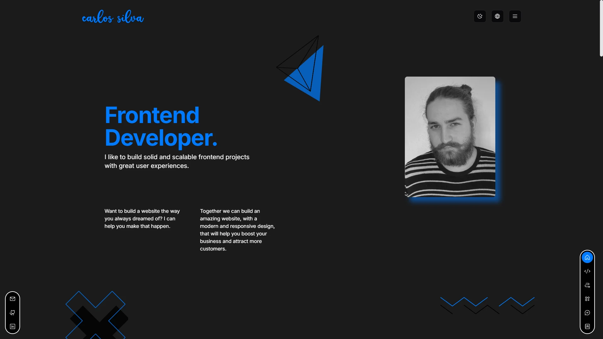

# 🌟 My Portfolio

This is my personal portfolio repository, created to showcase my skills, projects, and career as a front-end developer. The project was built using modern technologies to ensure performance, accessibility, and a pleasant visual experience.

## 🌐 Other Languages

- [Português](README.pt.md)

## 🚀 Technologies Used

- [Next.js](https://nextjs.org): React framework for server-side rendering and static website generation.
- [React](https://react.dev): Library for building user interfaces.
- [TypeScript](https://www.typescriptlang.org): JavaScript superset that adds static typing to code.
- [Tailwind CSS](https://tailwindcss.com): Utility CSS framework for fast styling.
- [Shadcn UI](https://ui.shadcn.com): Reusable and accessible UI components.
- [Framer Motion](https://motion.dev): Library for fluid and custom animations.
- [Zustand](https://zustand-demo.pmnd.rs): Simple and scalable state management.
- [React Hook Form](https://react-hook-form.com): Performance-focused form handling library.
- [Zod](https://zod.dev): Data validation and typing library.
- [Phosphor Icons](https://phosphoricons.com): Modern and flexible icons.
- [Embla Carousel](https://www.embla-carousel.com): Lightweight solution for carousels and sliders.

## 🌍 Features

- Multilingual: Support for pt-br and en-us.
- Light/Dark Mode: Switch between themes according to your preference.
- Responsive: Fully adapted to different screen sizes, from mobile devices to desktops.
- Elegant Animations: Fluid transitions and interactions thanks to Framer Motion.

## 🎨 Color Palette

The colors were chosen to reflect modernity and also a little of my personality:

- **Skyline Blue**: `#007AFF`
- **Eclipse Black**: `#000000`
- **Pure White**: `#FFFFFF`
- **Neutral Gray**: `#B3B3B3`
- **Soft Mist**: `#F2F2F7`
- **Midnight Shadow**: `#1B1B1B`

## 📦 Installation and Use

1. Clone the repository:

   ```bash
   git clone https://github.com/ycarlosedu/portfolio-nextjs.git
   ```

2. Access the project directory:

   ```bash
   cd portfolio-nextjs
   ```

3. Install the dependencies:

   ```bash
   npm install
   ```

4. Run the project:

   ```bash
   npm run dev
   ```

5. Access the project in the browser at http://localhost:3000.

## 📂 Folder Structure

```bash
internationalization/        # Translation files
public/                      # Static files
src/
├── app/[locale]/            # Project pages
├── components/              # Reusable components
├── hooks/                   # Custom hooks
├── lib/                     # Helper functions and utilities
├── server/                  # API calls
├── store/                   # Global states managed by zustand
├── styles/                  # Styling files
├── utils/                   # Reusable utility files
```

## 📷 Demonstration



## 🤝 Contributions

Contributions are welcome! If you have any suggestions or concerns, feel free to open an issue or submit a pull request.

## 📄 License

This project is licensed under the MIT License. See the [LICENSE](./LICENSE) file for more details.
