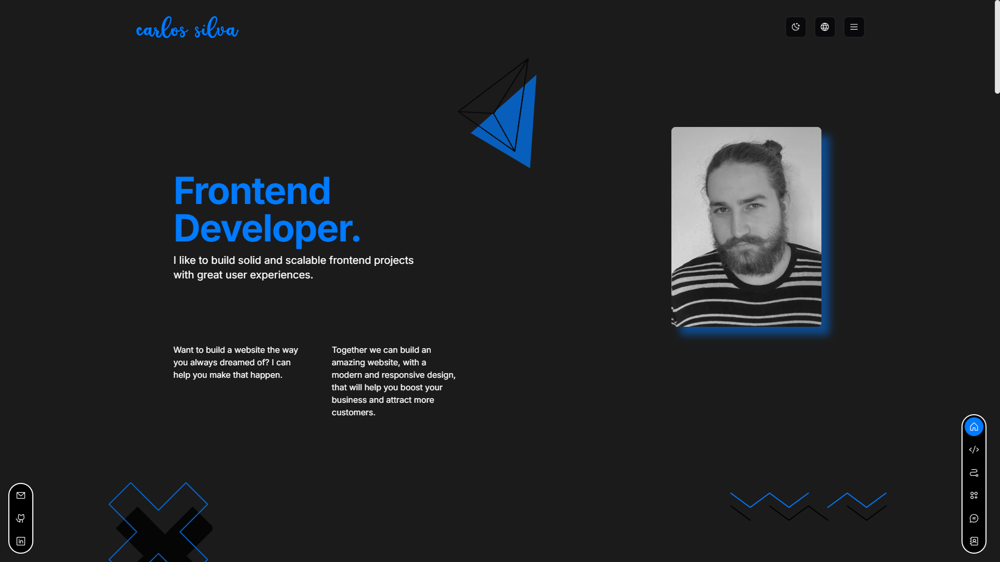

# 🌟 Meu Portfólio

Este é o repositório do meu portfólio pessoal, criado para apresentar minhas habilidades, projetos e trajetória como desenvolvedor front-end. O projeto foi construído utilizando tecnologias modernas para garantir desempenho, acessibilidade e uma experiência visual agradável.

## 🌐 Outros Idiomas

- [English](README.md)

## 🚀 Tecnologias Utilizadas

- [Next.js](https://nextjs.org): Framework React para renderização do lado do servidor e geração de sites estáticos.
- [React](https://react.dev): Biblioteca para construção de interfaces de usuário.
- [TypeScript](https://www.typescriptlang.org): Superset do JavaScript que adiciona tipagem estática ao código.
- [Tailwind CSS](https://tailwindcss.com): Framework de CSS utilitário para estilização rápida.
- [Shadcn UI](https://ui.shadcn.com): Componentes de interface reutilizáveis e acessíveis.
- [Framer Motion](https://motion.dev): Biblioteca para animações fluidas e personalizadas.
- [Zustand](https://zustand-demo.pmnd.rs): Gerenciamento de estado simples e escalável.
- [React Hook Form](https://react-hook-form.com): Biblioteca para manipulação de formulários com foco em performance.
- [Zod](https://zod.dev): Biblioteca de validação e tipagem de dados.
- [Phosphor Icons](https://phosphoricons.com): Ícones modernos e flexíveis.
- [Embla Carousel](https://www.embla-carousel.com): Solução leve para carrosséis e sliders.

## 🌍 Funcionalidades

- Multilíngue: Suporte para pt-br e en-us.
- Modo Claro/Escuro: Alterne entre os temas de acordo com sua preferência.
- Responsivo: Totalmente adaptado para diferentes tamanhos de tela, de dispositivos móveis a desktops.
- Animações Elegantes: Transições e interações fluídas graças ao Framer Motion.

## 🎨 Paleta de Cores

As cores foram escolhidas para refletir modernidade e também um pouco da minha personalidade:

- **Skyline Blue**: `#007AFF`
- **Eclipse Black**: `#000000`
- **Pure White**: `#FFFFFF`
- **Neutral Gray**: `#B3B3B3`
- **Soft Mist**: `#F2F2F7`
- **Midnight Shadow**: `#1B1B1B`

## 📦 Instalação e Uso

1. Clone o repositório:

   ```bash
   git clone https://github.com/ycarlosedu/portfolio-nextjs.git
   ```

2. Acesse o diretório do projeto:

   ```bash
   cd portfolio-nextjs
   ```

3. Instale as dependências:

   ```bash
   npm install
   ```

4. Execute o projeto:

   ```bash
   npm run dev
   ```

5. Acesse o projeto no navegador em http://localhost:3000.

## 📂 Estrutura de Pastas

```bash
internationalization/        # Arquivos de tradução
public/                      # Arquivos estáticos
src/
├── app/[locale]/            # Páginas do projeto
├── components/              # Componentes reutilizáveis
├── hooks/                   # Hooks personalizados
├── lib/                     # Funções auxiliares e utilitários
├── server/                  # Chamadas de API
├── store/                   # Estados globais gerenciados pelo zustand
├── styles/                  # Arquivos de estilização
├── utils/                   # Arquivos de utilidade reutilizáveis
```

## 📷 Demonstração



## 🤝 Contribuições

Contribuições são bem-vindas! Caso queira sugerir melhorias ou reportar problemas, sinta-se à vontade para abrir uma issue ou enviar um pull request.

## 📄 Licença

Este projeto está licenciado sob a licença MIT. Veja o arquivo [LICENSE](./LICENSE) para mais detalhes.
